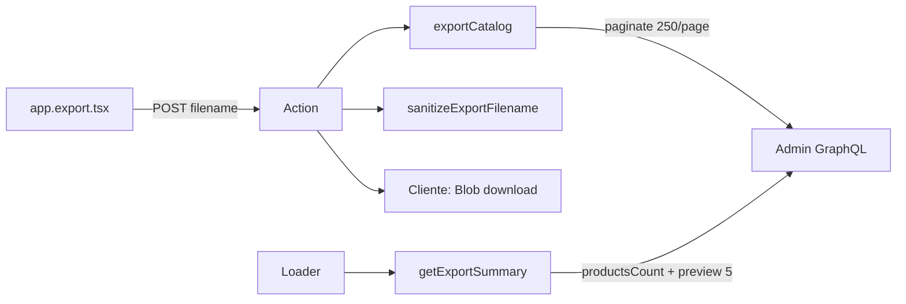

# Eng Plan: Exportación completa + nombre personalizado

**Fecha:** 2026-06-02  
**Estado:** Implementado (fase 1) — ver mejoras pendientes abajo  
**Skill gstack:** plan-eng-review

---

## Resumen de implementación

### Arquitectura



### Cambios clave

| Archivo | Cambio |
|---------|--------|
| `catalog-export.server.ts` | Paginación con `pageInfo.hasNextPage` / `endCursor`; `getExportSummary()` para loader ligero |
| `catalog-schema.ts` | `EXPORT_PAGE_SIZE=250`, `sanitizeExportFilename()` |
| `app.export.tsx` | Campo nombre + submit con FormData |
| `app._index.tsx` | Copy actualizado |

### GraphQL

- `productsCount { count }` — total sin traer todo al loader
- `products(first: 250, after: $cursor)` — export completo en action

---

## Edge cases cubiertos

| Caso | Comportamiento |
|------|----------------|
| Nombre vacío | Fallback `catalogo-YYYY-MM-DD.csv` |
| Caracteres inválidos en nombre | Stripped (`<>:"/\|?*` etc.) |
| Espacios en nombre | Reemplazados por `-` |
| Sin extensión | Se añade `.csv` |
| Tienda sin productos | CSV con solo header |
| Metafields distintos por producto | Headers unificados en union set |

---

## Mejoras pendientes (prioridad)

### P0 — Antes de tiendas >2.000 productos

1. **Streaming / chunked response** — Evitar cargar todo el CSV en memoria del action; usar `ReadableStream` o job async.
2. **Timeout handling** — Shopify request timeout ~60s; para 5k+ productos, mover export a background job (Prisma table `ExportJob`).

```typescript
// Esquema propuesto
model ExportJob {
  id        String   @id @default(cuid())
  shop      String
  filename  String
  status    String   // pending | running | done | failed
  productCount Int?
  csvUrl    String?  // S3/R2 temporal
  createdAt DateTime @default(now())
}
```

### P1 — UX

3. **Progress polling** — Action crea job → cliente poll `/app/export/status/:id` cada 2s.
4. **Cancelación** — AbortController en loop de paginación.

### P2 — Robustez

5. **Retry con backoff** — GraphQL throttling (429/cost exceeded).
6. **Tests unitarios** — `sanitizeExportFilename`, paginación mock, CSV round-trip.

---

## Plan de pruebas (/qa)

### Rutas afectadas

- `/app` — copy paso 1
- `/app/export` — loader, action, download

### Interacciones críticas

- [ ] Abrir Exportar → ver conteo total correcto
- [ ] Descargar sin cambiar nombre → `catalogo-YYYY-MM-DD.csv`
- [ ] Descargar con nombre `Mi Catálogo Verano` → `Mi-Catálogo-Verano.csv`
- [ ] CSV contiene todos los productos (comparar con Admin count)
- [ ] Vista previa muestra 5 filas sin bloquear carga

### Edge cases QA

- [ ] Tienda con 0 productos
- [ ] Nombre con caracteres especiales `<>:"|?*`
- [ ] Nombre >100 chars (truncado)
- [ ] Doble click en Descargar (no duplicar requests ideally)

---

## Performance estimada

| Productos | Páginas GQL | Tiempo aprox. |
|-----------|-------------|---------------|
| 50 | 1 | <2s |
| 500 | 2 | ~5s |
| 2.000 | 8 | ~15–25s |
| 10.000 | 40 | ⚠️ riesgo timeout — requiere P0 async |

---

## Decisión pendiente

**¿Export async con job queue o sync con progress bar simple?**

- Sync + progress: más rápido de implementar, suficiente hasta ~2k productos
- Async job: necesario para escala; requiere storage temporal

Recomendación: **sync ahora**, async cuando tengamos merchant con >2k productos o reportes de timeout.
